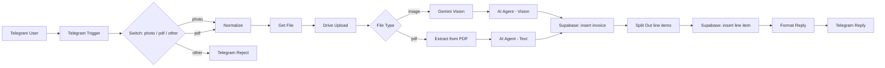

# OCR Invoice Agent

> Send a photo or PDF of an invoice to a Telegram bot. Get back a structured row in Supabase, a copy archived in Google Drive, and a confirmation reply — all in seconds.


## What it does

- Accepts invoice **photos** or **PDFs** sent over Telegram.
- Uses **Gemini Vision** for image OCR and **Gemini text + a structured-output parser** for PDFs.
- Persists the header row to a Supabase `invoices` table and one row per line item to `invoice_line_items`.
- Archives the original file to a Google Drive folder for audit trail.
- Replies to the sender with a human-readable summary of what was extracted.

## Architecture



## Tech stack

- [n8n](https://n8n.io) (self-hosted)
- Google Gemini 1.5 / 2.0 (Vision + text)
- Telegram Bot API
- Google Drive (archive)
- Supabase (Postgres) for persistence

## Setup

1. **Self-host n8n.** The Docker quickstart is the easiest path:
   ```bash
   docker run -it --rm --name n8n -p 5678:5678 -v n8n_data:/home/node/.n8n n8nio/n8n
   ```
2. **Create the Supabase tables.** Schema is workflow-defined; minimum useful columns:
   - `invoices`: `id`, `vendor`, `invoice_date`, `total_amount`, `currency`, `notes`, `created_at`
   - `invoice_line_items`: `id`, `invoice_id`, `description`, `quantity`, `unit_price`, `amount`
3. **Create credentials in n8n** (Settings → Credentials):
   - **Telegram Bot** (the bot token from BotFather)
   - **Google Drive OAuth2** (project on Google Cloud, Drive API enabled)
   - **Google Gemini (PaLM) API** (API key from [aistudio.google.com](https://aistudio.google.com))
   - **Supabase API** (project URL + service-role key)
4. **Import the workflow:** in n8n, Workflows → Import from File → pick [`workflow/ocr-invoice-agent.n8n.json`](workflow/ocr-invoice-agent.n8n.json).
5. **Wire credentials in the imported workflow.** Open each node that shows a yellow "credentials missing" badge and pick your credentials from the dropdown.
6. **Set the Drive folder** in the `Google Drive - Upload` node — replace the default with the folder ID where you want originals archived.
7. **Activate the workflow** (toggle in the top right).
8. Send your bot a photo of an invoice. You should get a structured reply within 5-15 seconds.

## Environment variables

Optional — only needed if you also want to use the helper scripts in `tools/` against your local n8n REST API. Copy `.env.example` to `.env` and fill in.

| Variable | Purpose | Where to get |
|---|---|---|
| `N8N_BASE_URL` | Your n8n instance URL | e.g. `http://localhost:5678` |
| `N8N_API_KEY` | n8n personal API key | n8n → Settings → API → Create |
| `N8N_OCR_INVOICE_WORKFLOW_ID` | Workflow ID once imported | Visible in the URL when editing the workflow |

## Tools

- `python tools/verify_workflow.py workflow/ocr-invoice-agent.n8n.json` — sanity-check the JSON before you sync.
- `python tools/sync_workflow.py workflow/ocr-invoice-agent.n8n.json` — push local edits to your running n8n.
- `python tools/list_executions.py --workflow <id>` — recent runs.
- `python tools/fetch_execution.py <execution_id>` — drill into one run.

All tools are standalone — no shared harness, no `requirements.txt`. They read `N8N_BASE_URL` and `N8N_API_KEY` from `.env`.

## See also

- [Workflow SOP](workflow/ocr-invoice-agent.md) — the prose version of the topology.
- [WAT framework](docs/WAT-framework.md) — the **W**orkflows / **A**gents / **T**ools pattern this repo follows.

## Credits

Built on [n8n](https://n8n.io). The WAT pattern and the project structure are reusable across the other agents in this series:

- [video-analysis-agent](https://github.com/JKP143/video-analysis-agent)
- [agentic-rag-agent](https://github.com/JKP143/agentic-rag-agent)
- [legal-ai-agent](https://github.com/JKP143/legal-ai-agent)

## License

MIT — see [LICENSE](LICENSE).
